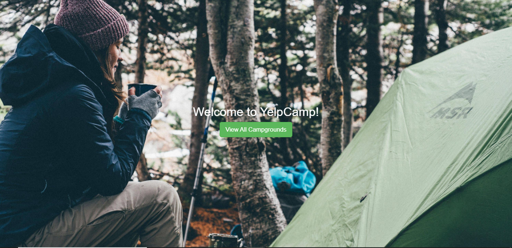
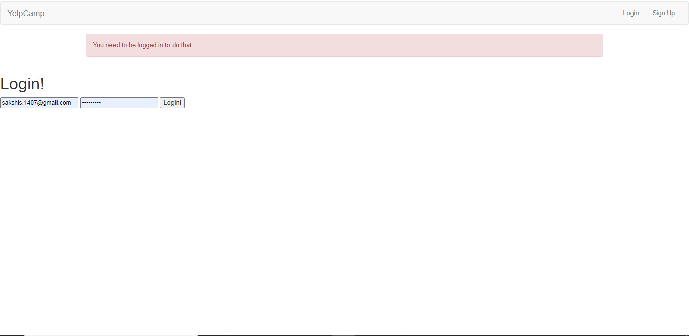

# Campgrounds-Portal
A website to enable users to add pictures with description, comments and ratings. Implemented user authentication features (signup, login, logout).

## Check it out! ##
Check it out [here](https://campgrounds-portal.herokuapp.com/) !

### Steps to run the app locally: ###

1. git clone https://github.com/sakshi-s/Campgrounds-Portal.git
2. cd Campgrounds-Portal
3. npm install
4. create a .env file and set DB_URL as the URL to your database
4. node app.js
5. Server starts running at "localhost:3000"

## Snapshots ##

